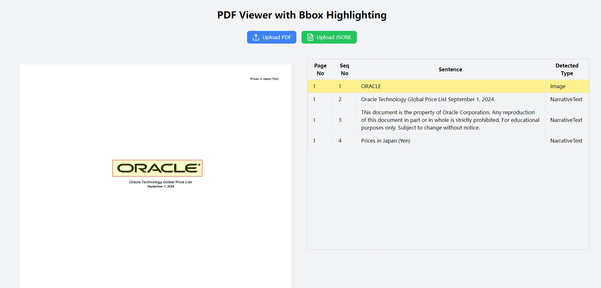
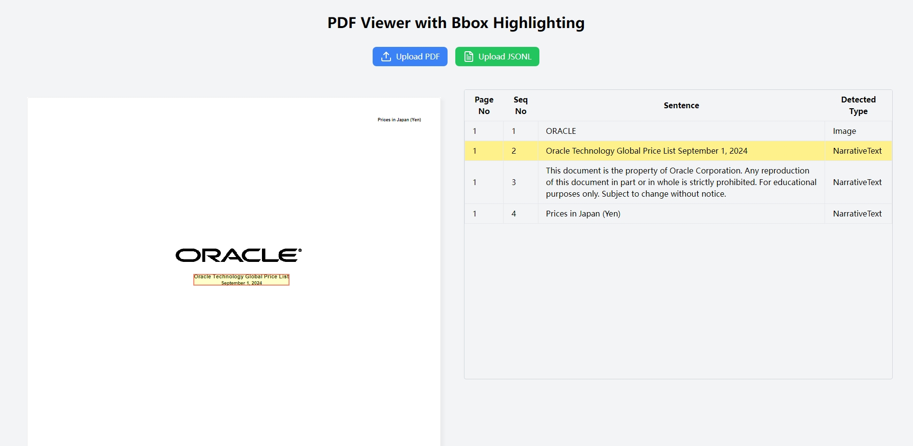
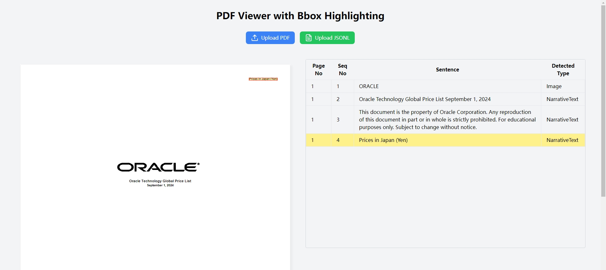
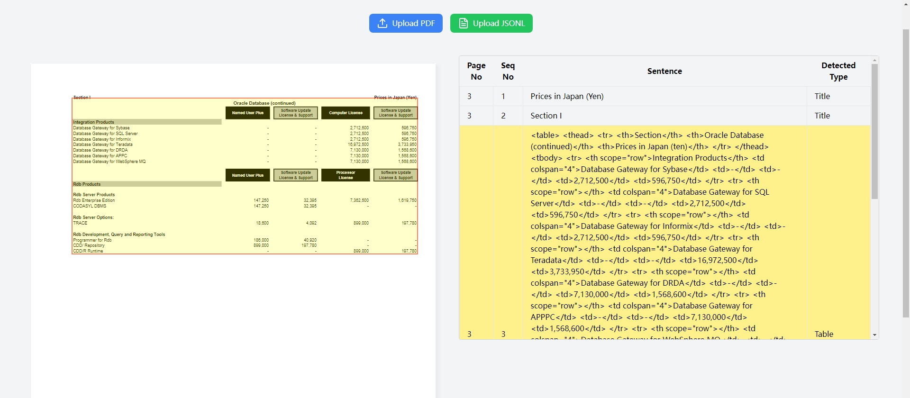

# Pdf Jsonl Viewer

This project is for viewing jsonl file of a pdf content by bbox.

## Installation

```shell
npm install
```

## Run

```
npm run dev
```

## Usage

Access [http://localhost:5173/](http://localhost:5173/), update a pdf file and upload the related jsonl file.

Select a line in jsonl file, the related bbox will be highlighted in the pdf file.

## Examples






## Thanks

Thanks [https://bolt.new](https://bolt.new)